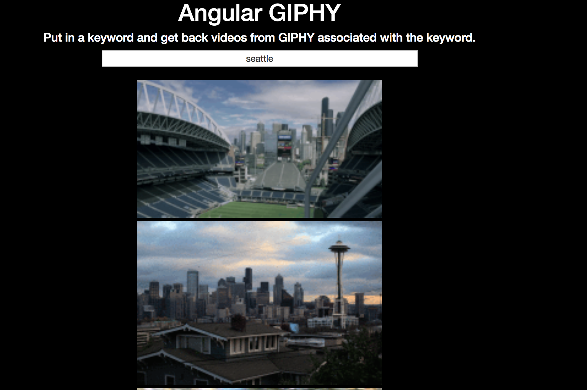

Objective: Develop a source for users to easily access the content available from the giphy API.

Goal: Search for content on GIPHY and get back all the GIF's of the searched term.

Build/Code: Built with Angular, JavaScript, HTML, and CSS.

Image:

